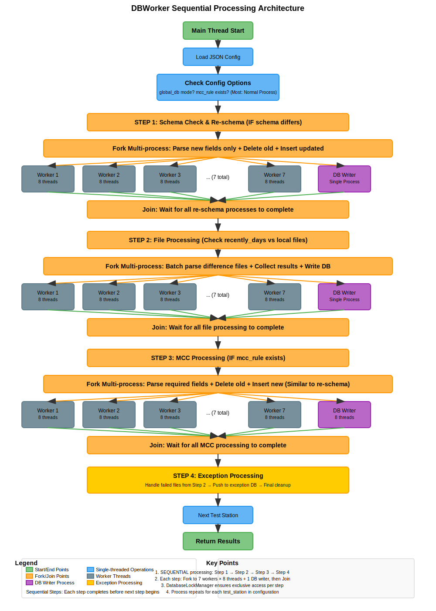

# dbWorker — Database & Log-Parsing Toolkit

[From Accton Technology Corporation]

`dbWorker` is a collection of Python 3 utilities that **parse production‐line log files**, load them into a MariaDB / MySQL database and provide rich analytics & reporting commands.

It was designed for factory environments where large volumes of *`.cap`* (capture) files are continuously produced by multiple SKUs / test-stations and must be converted into structured data in near-real-time.

---

## 1  Repository Layout

```text
┬ dbWorker/                 ← project root
├─ core/                    ← reusable utilities
│  ├─ Logger.py             · unified colourful logger (console + file)
│  └─ MySQLHelper.py        · thin wrapper around pymysql cursor/connection
│
├─ ParseEngine/             ← generic rule-based parser
│  ├─ engine/               · ParseEngine & ParseEngineData classes
│  └─ sku_setting/          · JSON rule files grouped by SKU / station
│
├─ workers/                 ← long-running or batch ingestion services
│  ├─ worker_monitor.py     · daemon that polls *info* drop-folder & ingest
│  ├─ worker_ult.py         · helper functions (timers, schema utils …)
│  ├─ worker_once_stable.py · single process original dbworker (multi-threads version)       
|  ├─ worker_once_multiprocess.py · one-shot folder synchronisation into DB
│  └─ processors/             # for worker_once_multiprocess functions
│      ├── __init__.py
│      ├── file_processor.py   # process_files relative 
│      ├── reschema_processor.py # re-schema relative 
│      └── mcc_processor.py    # mcc_process relative  
│
├─ tools/                   ← ad-hoc CLI helpers
│  ├─ parse_test.py         · quick parse of a file / folder with rules
│  ├─ db_structure_viewer.py· print DB → tables → columns tree
│  ├─ reporter.py           · yield-rate, FPY, jig & fail statistics
│  └─ tpver_to_skuSetting.py· map firmware `tpver` → best rule file
│
├─ database_checker.py      ← Confirm database integrity
│
├─ db_setting/              ← per-site JSON configs; credentials & topology
│  └─ db_setting*.json      · see example below
└─ README.md (this file)
```

## 2  Quick Start

```bash
# 1. Clone & enter
$ git clone <repo-url> && cd dbWorker

# 2. Create virtual-env (optional but recommended)
$ python3 -m venv .venv && source .venv/bin/activate

# 3. Install dependencies
$ pip install -r requirements.txt   # see Section 7 for contents

# 4. Edit database settings
$ cp db_setting/db_setting_example.json db_setting/db_setting.json
$ vim db_setting/db_setting.json     # fill in host/user/password …

# 5. Ingest a folder once
$ python3 worker/worker_once_stable.py --config db_setting/db_setting.json   # logs in ./logs/
```

> **Tip** Every script can also be launched directly, e.g. `python3 tools/parse_test.py …`. Internally each script appends the project root to `sys.path`, so absolute location does not matter.

---

## 3  db_setting.json Explained

```jsonc
{
  "host"            : "127.0.0.1",
  "user"            : "root",
  "password"        : "secret",
  "port"            : 3306,
  "default_recently_days": 30,
  "default_enable"  : true,
  "sku_parser_rule" : {
    "K2V5_JRD03_R" : {
      "dbname"      : "k2v5_jrd03r",
      "test_station": {
        "pt" : {
          "folder"   : "/mnt/FTP_log/.../PT",
          "tablename": "pt",
          "rule"     : "ParseEngine/sku_setting/k2v5_jrd03r/k2v5_jrd03r_pt.json",
          "recently_days": 7,
          "time_column"  : "tbeg",
          "mcc_rule" : "ParseEngine/sku_setting/mcc.json" // if it has MCC.
        }
      }
    }
  },
  "info_folder"           : "/mnt/info",     // worker_monitor only
  "info_path_replace_org" : "/mnt/FTP_log", // path substitution
  "info_path_replace_dst" : "/ftp",
  "insert_error_folder"   : "./log_bin/insert_error",
  "parse_failure_folder"  : "./log_bin/parse_failure",
  "sku_undefined_folder"  : "./log_bin/sku_undefined",
  "unknow_failure_folder" : "./log_bin/unknown",
  "polling_sleep_secs"    : 3
}
```

---

## 4  Main Scripts

| Script | Purpose | Example |
| ------ | ------- | ------- |
| `tools/parse_test.py` | Parse single `.cap` or whole folder & print or save to CSV | `python3 tools/parse_test.py --json_rule sku.json --cap C519…441.cap` |
| `workers/worker_once_stable.py` | Batch insert *new* files under each configured folder into its DB table (no config parameter is default test_db json avoid wrong operation) | `python3 workers/worker_once.py --config db_setting/db_setting.json` |
| `workers/worker_monitor.py` | Watch an *info* drop-folder for new `*.txt` manifests, parse corresponding `.cap`, insert and route successes / errors to sub-folders | `python3 -m workers.worker_monitor` |
| `tools/reporter.py` | Analyse WO yield, fail distribution, JIG stats, SN history | `python3 tools/reporter.py --wo WO12345 --fail --jig` |
| `tools/db_structure_viewer.py` | Pretty-print tables & schemas of every non-system DB | `python3 tools/db_structure_viewer.py` |
| `tools/tpver_to_skuSetting.py` | Given firmware `tpver`, suggest best matching rule file (largest or smallest JSON) | `python3 tools/tpver_to_skuSetting.py` |
| `tools/database_checker.py` | Check the differece between local files and db files and generate a report | `python3 tools/database_checker.py` |
| `tools/database_duplicate_finder.py` | Check the duplicate files in DB | `python3 tools/database_duplicate_finder.py` |
| `tools/null_rate_db.py` | Check NULL rate in db different columes with database_config.json to work | `python3 tools/null_rate_db.py` |


### Worker_once Architecture

The `worker_once_stable.py` script uses a sophisticated multi-threading architecture to achieve high-performance batch processing:



**Performance Optimization:**
- writer(mcc/file/re-schema) program pattern with thread-safe queue
- Batch insertion: 100~1000 records/second to database (Depends on Rule Complexity)
- Automatic schema synchronization
- Exception tracking in separate database
- Current 3 million records in main db, Data timestamp is around 150 days. (Re-make) Almost Cost one night to push.

---

## 5. Database/Table Lock Handling

To ensure safe concurrent operation, `dbWorker` uses explicit database and table locking with short timeouts:

- If a database or table is locked by another process, the current operation **skips** that table or database and moves on, avoiding long waits or deadlocks.
- Only minimal warnings are logged for lock timeouts (e.g., `[WARN] Skipped table pt due to lock timeout`).
- This makes the toolkit robust for multi-process or multi-user environments.

---

## 6. Logging

`core.Logger` sends **ANSI-coloured**, timestamped messages to stdout **and** daily-rotated files under `./logs/<YYYYMMDD>.log`.
Log levels: *INFO*, *WARN*, *ERROR*, *OK*, *TITLE*, *SUB_TITLE*.

---

## 7. Extending the Parse Engine

### Important: ParseEngine Setup

The project depends on a separate ParseEngine repository. After cloning this repository, you need to also clone the ParseEngine:

```bash
git clone http://61.219.235.17:7105/K2_COMM/ParseEngine.git
```

---

## 8. Dependencies

The project requires the following dependencies, which are specified in the provided `requirements.txt` file:
```text
pymysql>=1.1.0
pandas>=2.0.0
```

Install all dependencies with:
```bash
pip install -r requirements.txt
```

---

## 9. Troubleshooting

| Symptom | Cause / Fix |
| ------- | ----------- |
| `ModuleNotFoundError` for *core.Logger* | Make sure you are **inside** project root or ran module with `python3 -m …`. Each script dynamically inserts the parent dir into `sys.path`. |
| `Table … does not exist` warnings | The rule refers to a table that hasn’t been created yet → run `worker_once_stable.py` to auto-create via `MySQLHelper.create_table()` |
| Cannot connect to DB | Check `host`, `port`, firewalls, credentials inside *db_setting.json* |
| Skipped table due to lock timeout | Another process is using the table/database. This is normal in concurrent environments. |

---

## 10. License & Contributing

This code is proprietary **Accton Technology** tooling. Please contact the maintainers before redistributing.

Contributions are welcome via pull requests: follow *PEP-8*, type-hint new functions, and include unit tests under `tests/`.
